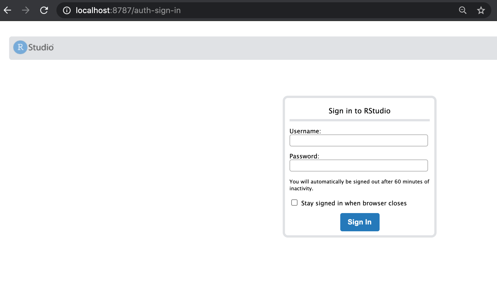
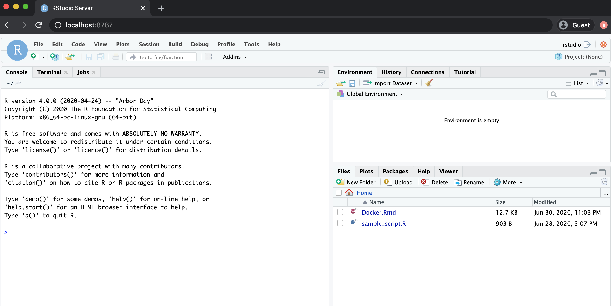

```{r setup, include=FALSE}
knitr::opts_chunk$set(echo = TRUE)
library(knitr)
```


<!-- Ever had problems with sharing code? Missing libraries or different versions of R? One solution is to use Docker as a method for sharing work. -->


Docker is a very useful method of creating and running isolated versions of software. It is useful because working versions of software can be built and run using only the necessary libraries. 
Another useful feature is that the libraries used to build the software are fixed, and when sharing a Docker image it will run identically on different machines. For example, if you build and run a simulation using R 3.6.0, you can build a Docker image containing your code and R 3.6.0. This image can be shared with anyone and it will allow them to run your code using R 3.6.0, an exact replica of the environment you originally used.

## Getting Started

For a more general introduction to Docker and help with installation and setup, see the following page: 
[docs.docker.com/get-started](https://docs.docker.com/get-started/) (4 min read).

#### Docker Images and Containers

An image is a template for an environment, software and files. Images are created using a Dockerfile which is covered later in this document.
A container is a runnable instance of an image. Once an image is created, a container can be started using this image; at this stage the software will be live on the host machine. For example, if an RStudio container is running, then a copy of RStudio will be available to use. This copy will be independent of any other local version of RStudio.

You can have many containers running simultaneously on your machine, and in general they will be isolated and independent of each other.

Images and containers can be managed through commands on a terminal or a bash shell.

<!-- For a more detailed explanation see [this guide](https://docs.docker.com/get-started/overview/). -->
 


## Docker and R

There are many different R and RStudio images.

Official R images can be found here:
[https://hub.docker.com/_/r-base](https://hub.docker.com/_/r-base)

RStudio and Shiny server images can be found here:
[https://hub.docker.com/u/rocker](https://hub.docker.com/u/rocker)

An image can be downloaded using the `docker pull` command. Alternatively, when `docker run` is used if the image is not found on your local system it will be downloaded.


### Starting an RStudio Container

To run an RStudio image use the following command in terminal:
```{bash, eval =FALSE}
$ docker run -detach -p 8787:8787 -e PASSWORD=yourpassword --name my-rstudio rocker/rstudio
```

There are a few things to note, namely the flags used in the run command: 

- `-detach` or `-d` for short, runs the container in the background of your terminal.
- `--publish` or `-p` forwards the port on your machine to the container's port. This is important for running RStudio (port 8787) and/or a Shiny server (port 3838) as a container. It is also important when running multiple containers.
- `--name` gives a name to your container. This is not necessary but it's useful for managing containers (stopping, removing, etc..).
- `-e` is used for environment variables. In this case the variable `PASSWORD` needs to be provided, any string can be chosen as the password.


To check the containers currently running on your machine use `docker ps --all`, you should see similar output to below.

```{bash, eval =FALSE}
$ docker ps --all

CONTAINER ID  IMAGE                 COMMAND  CREATED        STATUS        PORTS                   NAMES
96f368aefb83  rocker/rstudio:3.6.0  "/init"  9 seconds ago  Up 8 seconds  0.0.0.0:8787->8787/tcp  my-rstudio
```


#### Opening RStudio

RStudio can now be opened by going to `localhost:8787` in a web browser. The username will be `rstudio` and password will be the variable provided. In the case above I picked `yourpassword`.


```{r , echo = F, out.width=600, fig.align='center'}

```


#### Running Multiple Containers

The `-p` flag in the run command determines which port RStudio can be found at. For example, if we used `-p 8000:8787` RStudio will then be accessible using `localhost:8000` in a web browser. This is useful when running multiple versions of R and RStudio, because each container will need to be routed through a different port.

Note: more advanced uses of Docker containers allow communication between containers, but this will not be covered here. See the [Docker website](https://docs.docker.com/) for further reading.


### Versions of R

An important feature of Docker images is version control, which is managed by 'tagging' an image. The available RStudio tags can be found [here](https://hub.docker.com/r/rocker/rstudio/tags). To start a container with a specific tag, the tag name is added with a colon after the image name.

For example, to use RStudio with the current development version of R use:  
```{bash, eval = F}
$ docker run -d -p 8001:8787 -e PASSWORD=yourpassword --name my-rstudio-devel rocker/rstudio:devel
```  
or to use version 3.6.0:
```{bash, eval = F}
$ docker run -d -p 8002:8787 -e PASSWORD=yourpassword --name my-rstudio-363 rocker/rstudio:3.6.3
```

As mentioned in the section above, both containers can be run simultaneously. In this example, the development and 3.6.3 versions of R will be accessible simultaneously in a web browser at `localhost:8001` and `localhost:8002` respectively.

`latest` is used as a default tag when no specific tag is provided, i.e. if only `rocker/rstudio` is used then `rocker/rstudio:latest` will be downloaded/started.


### Stopping Containers

To stop a container use the `docker rm` command:
```{bash, eval =FALSE}
$ docker rm --force my-rstudio-devel
```

```{bash, eval =FALSE}
$ docker rm --force my-rstudio-363
```


<br>

## Reproducible Research

For reproducible research the environment used each time to run the code should match as much as possible. Details such as the version of R and the version of individual packages/libraries can have an effect on the final results.  

We have seen that a specific version of R can be chosen when using Docker. R scripts can also be included in a custom Docker image. 

A complete standalone environment can be created so that an end user does not need to worry about installing any extra libraries or having specific software installed. The only requirement is to have Docker installed.


### Dockerfile

To build a Docker image, you will need to create a Dockerfile. This file is essentially a configuration determining what libraries, files and/or data should be included in the image. This file can be created and edited using any editor such as [VIM](https://www.vim.org/) or even RStudio. The file does not use an extension and is usually simply saved as `Dockerfile`.

The example file below can downloaded using [this link](https://raw.githubusercontent.com/aboland/ReproducibleResearch/master/Docker/SimpleDockerfile).

```
FROM rocker/rstudio:4.0.0

RUN apt-get update \
  && apt-get install -y --no-install-recommends \
  libxml2 \
  git

RUN install2.r --error \
  --deps TRUE \
  devtools \
  ggplot2

COPY Docker/Docker.Rmd /home/rstudio/
COPY Docker/Simple_Example/sample_script.R /home/rstudio/
```

- Dockerfiles start with a base image using the `FROM`, in this example `rocker/rstudio:4.0.0`. This is a pre existing image which has R and RStudio already installed.
- System libraries can be installed using `RUN apt-get install`
- `COPY` is used to copy files or data from your system into the image. If you want to be able to access files or data in the container they must be copied across in this way.


#### R Libraries

- The most straight forward way to install an R library is to use `install2.r`  
The `--error` flag ensures that the image build will fail if the R library fails to install.
- A specific version of a library can be installed using the `devtools` package  
`RUN R -e 'install.packages("devtools")'`  
`RUN R -e 'devtools::install("ggplot2", version = "3.3.0")'`

Some libraries can take a long time to install. If you consistently use a certain set of libraries it may be useful to create an image containing these libraries. This can be used as your base image to start from. For example, if you use many of the [tidyverse](https://www.tidyverse.org/) libraries, these have a long installation time. A quicker way to build the above image starts with `rocker/tidyverse:4.0.0`.

```
FROM rocker/tidyverse:4.0.0

COPY Docker/Docker.Rmd /home/rstudio/
COPY Docker/Simple_Example/sample_script.R /home/rstudio/
```


### Building Images

By default Docker will look for a file called `Dockerfile` in the current working directory. In this case the following command can be used to build an image. The `--tag` or `-t` is used to give the image a name, in this case the image will be saved as `image_name`.

```{bash, eval =FALSE}
$ docker build --tag image_name .
```

The `-f` flag can be used to specify what file to use as the dockerfile. In the example below a file called `mycustomedockerfile` is used to create a Docker image named `image_name`.

```{bash, eval =FALSE}
$ docker build -t image_name -f mycustomedockerfile .
```


### Sharing Images

Images can be stored and shared using the Docker central repository.

The only requirement to run an image is to have Docker installed. A person would not need R or RStudio installed on their local machine. It's even possible to include a copy of LaTeX with an image so that PDF document's can be knitted.

For more detailed information on setting up a Docker account and sharing images see [this tutorial](https://docs.docker.com/get-started/part3/).

In short, it's possible to tag an image with your Docker account and save it in the central repository. Once here anyone can then pull and run the image.

```{bash, eval =FALSE}
$ docker tag image_name:tag <Your Docker ID>/image_name:tag
$ docker push <Your Docker ID>/image_name:tag
```


<br>

#### Example

The following example uses the files contained in [this Github repository](https://github.com/aboland/ReproducibleResearch).

Navigating to the root directory of the repository using terminal, and running the following commands builds and pushes the image.
```{bash, eval =FALSE}
$ docker build -t sample_rstudio:1.0 -f Docker/SimpleDockerfile .
$ docker tag sample_rstudio:1.0 bolandai/sample_rstudio:1.0
$ docker push bolandai/sample_rstudio:1.0
```

The Dockerfile is named `SimpleDockerfile` and is located in the `Docker` folder within the repository.

- First the image is built, it is named `sample_rstudio` and tagged `1.0`.  
- Next, the image is tagged with my Docker ID and give it's given the same name and tag as before.
- Finally the image is pushed to the central repository.

Since it is a public Docker repository, anyone with Docker installed can run the following command and start a container with my image. 
```{bash, eval =FALSE}
$ docker run -d -p 8787:8787 -e PASSWORD=mypassword bolandai/sample_rstudio
```

The [R Markdown file](https://github.com/aboland/ReproducibleResearch/blob/master/Docker/Docker.Rmd) used to create this document is included in the image and is available to edit and knit in the Home directory when RStudio starts.

```{r , echo = F, out.width=600, fig.align='center'}

```


<br><br><br>

# Advanced Use

## Linking to local directory

It was mentioned earlier that Docker containers are completely isolated. However, sometimes it is necessary to communicate outside of the container, for example to save data on your the local machine.

The Docker container can be linked with a local folder at the time of starting the container. The `-v` flag is used for this purpose. The below command will link the RStudio home folder with the desktop of the local machine running the container. Anything saved or edited in the home folder when using the container will be stored on the local desktop.

```{bash, eval =FALSE}
$ docker run -d -p 8787:8787 -e PASSWORD=mypassword -v ~/Desktop:/home/rstudio/ bolandai/sample_rstudio
```


## Continuous Integration (Git & Travis)

To create a nice workflow, it's possible to automate the Docker build process. Once code is stored on Github, the docker image can be remotely built when the code is updated. 

Two options for this are to use Docker Hub or Travis CI

### Docker Hub

Docker Hub which is used for storing and sharing images can be linked to Github so that the image is automatically built for specific branches when code is updated.

See [this article](https://docs.docker.com/docker-hub/builds/) for more information.

### Travis CI

An alternative is to use [Travis CI](https://travis-ci.org/). Travis CI must also be linked to Github in order to work. As well as building the Docker image, Travis CI can also be used to build and test personal R packages.

An example of using Travis CI can be seen [here](https://travis-ci.org/github/aboland/ReproducibleResearch).


