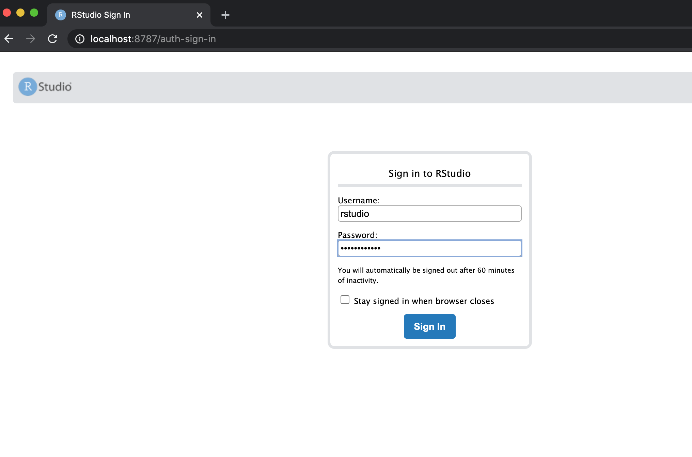

```{r setup, include=FALSE}
knitr::opts_chunk$set(echo = TRUE)
library(knitr)
```


Ever had problems with sharing code? Missing libraries or different versions of R. One solution is to use Docker as a method for sharing work.

<!-- In this piece, I focus on R, however the example I created has a version of Python included with it and so Python scripts could be shared in a similar way. -->

Docker is a very useful method of creating and running isolated versions of software. It is useful because working versions of software can be built and run using only the necessary libraries. 
Another useful feature is that the libraries used to build the software are fixed and when shared the Docker image will run identically on different machines.  
For example, if you build and run a simulation using R 3.6.0, you can build a Docker image containing your code which runs R 3.6.0. This image can be shared with anyone and when run they will be able to run your code using R 3.6.0, an exact replica of the environment you originally used.

## Getting Started

For an introduction to Docker and help with installation and setup, see the following page,
[docs.docker.com/get-started](https://docs.docker.com/get-started/) (4 min read).

## Docker and R

There are many different R and RStudio images  

Official R images can be found here:
[https://hub.docker.com/_/r-base](https://hub.docker.com/_/r-base)

While RStudio and Shiny images can be found here:
[https://hub.docker.com/u/rocker](https://hub.docker.com/u/rocker)

Images can be downloaded using the `docker pull` command or, when `docker run` is used if the image is not found on your local system it will be downloaded.


### Starting an RStudio Container

To run an RStudio image, in terminal use the following command
```{bash, eval =FALSE}
docker run -detach -p 8787:8787 -e PASSWORD=yourpassword --name my-rstudio rocker/rstudio
```

This starts a 'container' using the specified image. When an image is running on your computer it is referred to as a container, you can have many containers running simultaneously on your machine.

There are a few other things to note, namely the flags used in the run command  

- `-detach` or `-d` for short, runs the container in the background of your terminal.
- `--publish` or `-p` forwards the port on your machine to the containers port, this is important for running RStudio and/or a Shiny server as a container. It is even more important when running multiple containers.
- `--name` gives a name to your container, this is not necessary but it's useful for managing containers, stopping, restarting etc..
- `-e` is used for environment variables, in this case the variable `PASSWORD` needs to be provided, any string can be chosen as the password.


To check the containers currently running on your machine use `docker ps --all`, you should see similar output to below.

```{bash, eval =FALSE}
$ docker ps --all

CONTAINER ID  IMAGE                 COMMAND  CREATED        STATUS        PORTS                   NAMES
96f368aefb83  rocker/rstudio:3.6.0  "/init"  9 seconds ago  Up 8 seconds  0.0.0.0:8787->8787/tcp  my-rstudio
```


#### Opening RStudio

RStudio can now be opened by going to `localhost:8787` in a web browser. The user name will be `rstudio` and password will be the variable proved, in the case above `yourpassword`.


```{r , echo = F, out.width=600, fig.align='center'}

```


#### Running multiple containers

The `-p` flag in the run command determines which port RStudio can be found at.  
For example, if we used -`p 8000:8787` RStudio will then be accessible using `localhost:8000` in a web browser. This is useful for running multiple versions of R and RStudio, each container will be completely isolated from each other.  

Note: more advanced uses of Docker containers allow communication between containers, this will not be covered here.


### Versions of R

An important feature of docker images is version control, images can be 'tagged' with a version. In the case of the RStudio image the available tags can be found [here](https://hub.docker.com/r/rocker/rstudio/tags). To start a container with a specific tag, the tag name is added with a colon after the image name.

For example, to use RStudio with the current development version of R:
```{bash, eval = F}
$ docker run -d -p 8001:8787 -e PASSWORD=yourpassword --name my-rstudio-devel rocker/rstudio:devel
```  
or to use version 3.6.0:
```{bash, eval = F}
$ docker run -d -p 8002:8787 -e PASSWORD=yourpassword --name my-rstudio-363 rocker/rstudio:3.6.3
```

As mentioned in the section above, both containers can be run simultaneously. The development and 3.6.3 versions of R will be accessible in a web browser at `localhost:8001` and `localhost:8002` respectively.


### Stopping Container

To stop a container, the `docker rm` command can be used
```{bash, eval =FALSE}
$ docker rm --force my-rstudio-devel
```

```{bash, eval =FALSE}
$ docker rm --force my-rstudio-363
```


## Reproducible Research

For reproducible research the environment used each time to run the code should match as much as possible. Details such as the version of R, the version of individual libraries can have an effect on the final results. We have seen that specific versions of R can be run using Docker. Custom Docker containers can be created which include extras, such as R scripts.


### Dockerfile

To build a Docker image, you will need to create a Dockerfile. This file is essentially a configuration determining what libraries and files should be included in the image.


The Dockerfile starts with a base image, for example `FROM rocker/rstudio:4.0.0`. Everything else is built on top of this image.

#### System Libraries

Some R packages require certain underlying system libraries. These libraries can be installed using the `RUN` command.

```
RUN apt-get update && apt-get install libxml2
```

#### R Libraries

The most straight forward way to install an R library is to use the `install2.r` command
```
RUN install2.r --error devtools
```
The `--error` flag ensures that the image build will fail if the R library fails to install.


A specific version of a library can be installed using the `devtools` package
```
RUN R -e 'install.packages("devtools")'
RUN R -e 'devtools::install("ggplot2", version = "3.3.0")'
```


#### Example Dockerfile

To improve readability `\` can be used to spread single commands over multiple lines.

```
FROM rocker/rstudio:4.0.0

RUN apt-get update \
  && apt-get install -y --no-install-recommends \
  libxml2 \
  git

RUN install2.r --error \
  --deps TRUE \
  devtools \
  ggplot2

COPY Docker/Docker.Rmd /home/rstudio/
COPY Docker/Simple_Example/sample_script.R /home/rstudio/
```

Some libraries can take a while to install, if you consistently use a certain set of libraries it may be useful to create an image containing these libraries. This can be used as your base image to start from. For example, if you use many of the [tidyverse](https://www.tidyverse.org/) libraries, these have a long installation time. A quicker way to build the above image starts with the `rocker/tidyverse:4.0.0`.

```
FROM rocker/tidyverse:4.0.0

COPY Docker/Docker.Rmd /home/rstudio/
COPY Docker/Simple_Example/sample_script.R /home/rstudio/
```


### Building Image

If there is a file named `Dockerfile` in the current working directory, the following command can be used to build an imaged named `my_image`

```{bash, eval =FALSE}
$ docker build --tag image_name .
```

The `-f` flag can be used to specify what Dockerfile to use.

```{bash, eval =FALSE}
$ docker build -t image_name:tag -f mycustomedockerfile .
```


### Sharing Image

Images can be stored and shared using the Docker central repository.

The only requirement to run an image is to have Docker installed. A person would not need R or RStudio installed on their local machine. It's even possible to include a copy of LaTeX with an image so that PDF document's can be knitted.

For more detailed information on setting up a Docker account and sharing images see [this tutorial](https://docs.docker.com/get-started/part3/).


In short, it's possible to tag an image with your Docker account and save it in the central repository. Once here anyone can then pull and run the image.

```{bash, eval =FALSE}
$ docker tag image_name:tag <Your Docker ID>/image_name:tag
$ docker push <Your Docker ID>/image_name:tag
```


#### My Local Example

The following example uses the files contained in [this Github](https://github.com/aboland/ReproducibleResearch) repository. The code can be used to create this document and run a simple R example. 

I have a Dockerfile named `SimpleDockerfile` which is located in the `Docker` folder within the repository.

- First the image is built, it is named `sample_rstudio` and tagged `1.0`.  
This command is run from the root directory of the repository and so the path for the Dockerfile is `Docker/SimpleDockerfile`.
- Next, the image is tagged with my Docker ID and give it's given the same name and tag as before.
- Finally the image is pushed to the central repository.
```{bash, eval =FALSE}
$ docker build -t sample_rstudio:1.0 -f Docker/SimpleDockerfile .
$ docker tag sample_rstudio:1.0 bolandai/sample_rstudio:1.0
$ docker push bolandai/sample_rstudio:1.0
```


Since it is a public Docker repository, anyone with Docker installed can run the following command and start a container with my image. 
```{bash, eval =FALSE}
$ docker run -d -p 8787:8787 -e PASSWORD=temppassword bolandai/sample_rstudio
```

The [R Markdown file](https://github.com/aboland/ReproducibleResearch/blob/master/Docker/Docker.Rmd) used to create this document is included in the image and is available to edit and knit in the Home directory when RStudio starts.


<br><br><br>

# Advanced Use

## Linking to local directory

It was mentioned earlier that Docker containers are completely isolated, this can be very useful. However, sometimes it is necessary to communicate outside of the container, for example to save data onto the local machine.

The Docker container can be linked with a local folder at the time of starting the container. The `-v` flag is used for this purpose. The below command will link the RStudio home folder with the desktop of the local machine running the container. Anything saved or edited in the home folder when using the container will be stored on the local desktop.

```{bash, eval =FALSE}
$ docker run -d -p 8787:8787 -e PASSWORD=temppassword -v ~/Desktop:/home/rstudio/ bolandai/sample_rstudio
```


## Continuous Integration (Git & Travis)

To create a nice workflow, it's possible to automate the Docker build process. Once code is stored on Github, the docker image can be remotely built when the code is updated. 

Two options for this are to use Docker Hub or Travis CI

### Docker Hub

Docker Hub which is used for storing and sharing images can be linked to Github so that the image is automatically built for specific branches when code is updated.

See [this article](https://docs.docker.com/docker-hub/builds/) for more information.

### Travis CI

An alternative is to use [Travis CI](https://travis-ci.org/). Travis CI must also be linked to Github in order to work. As well as building the Docker image, Travis CI can also be used to build and test personal R packages.

An example of using Travis CI can be seen [here](https://travis-ci.org/github/aboland/ReproducibleResearch).


